<!-- ==================== HERO ==================== -->

  

  
  

---

# 👋 About Me

I'm a developer and learner exploring **AI/ML, systems, software engineering, and developer tools**.

I like turning ideas into working systems — and then going deeper to understand **what actually happens underneath the abstraction**.

---

# ⚡ Currently Building

| Project | Focus |
|---|---|
| 🧠 **LLM / Jarvis** | Exploring tokenization, embeddings, attention, model architecture and personalized AI systems. |
| 🖥️ **MTAD** | Windows task and focus management with scheduling, process control, notifications and GUI development. |
| ⚙️ **Advanced Coder** | Exploring program visualization, execution tracing and output/state analysis. |
| 🏺 **Waves → 3D** | Researching underground imaging concepts and 2D → 3D reconstruction. |

---

# 🧠 What I'm Exploring

**AI / ML**

`Tokenization` • `BPE` • `Embeddings` • `Attention` • `Neural Networks` • `LLM Architecture`

**SYSTEMS**

`Operating Systems` • `Processes` • `Automation` • `Windows Internals` • `Developer Tools`

**ALGORITHMS**

`DSA` • `Search` • `Game Engines` • `Program Analysis`

---

# 🛠️ Tech Stack

### Languages

  
  
  

### AI / ML / Systems

  
  
  
  

### Development

  
  

---

# 🚀 Featured Projects

## 🧠 LLM / JARVIS

Exploring the foundations of a personalized language-model system.

**Pipeline**

`Text` → `Tokenization` → `BPE` → `Embeddings` → `Attention` → `Neural Network` → `Language Model`

---

## 🖥️ MTAD

A Windows-focused task and focus management system.

**Core Areas**

`Rules` • `Scheduling` • `Process Control` • `Focus Mode` • `Notifications` • `Auto Start` • `PySide6`

---

## ⚙️ Advanced Coder

A developer-tool concept focused on making program execution easier to understand.

**Execution View**

`Code` → `Control Flow` → `Execution Trace` → `Variable State` → `Data Structures` → `Output / Result`

The goal is to reduce the amount of execution state a developer has to mentally simulate.

---

## 🏺 Waves → 3D

A research-oriented project exploring underground imaging concepts and the transformation of measured data into 3D representations.

**Focus**

`Signal Processing` • `Material Detection` • `Imaging` • `3D Reconstruction`

---

## ♟️ Game Engine Experiments

Algorithmic projects exploring game-engine architecture and search.

**Exploring**

`Chess` • `Go` • `Search` • `Evaluation` • `Game State` • `Optimization`

---

# 📊 GitHub Activity

---

# 🐍 Contribution Matrix

<table align="center" width="100%">
  <tr>
    <td align="center">Jan</td>
    <td align="center">Feb</td>
    <td align="center">Mar</td>
    <td align="center">Apr</td>
    <td align="center">May</td>
    <td align="center">Jun</td>
    <td align="center">Jul</td>
    <td align="center">Aug</td>
    <td align="center">Sep</td>
    <td align="center">Oct</td>
    <td align="center">Nov</td>
    <td align="center">Dec</td>
  </tr>
</table>

  

  Less
  &nbsp;&nbsp;
  🟪 🟪 🟪 🟪 🟪
  &nbsp;&nbsp;
  More

---

# 🧭 What I'm Working Toward

| Area | Direction |
|---|---|
| 🤖 **AI / ML** | Fundamentals, neural networks, LLM systems and experimentation |
| 🖥️ **Systems** | Operating systems, automation, developer tooling and architecture |
| 🧮 **Algorithms** | DSA, search, program analysis and game engines |
| 🔬 **Research** | Experimental problem solving and technical exploration |

---

# 💡 Engineering Philosophy

> **Ideas → Code → Reality**

Build it.  
Understand it.  
Break it.  
Improve it.

---

  Learning in public • Building continuously • Exploring deeply

